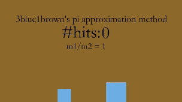
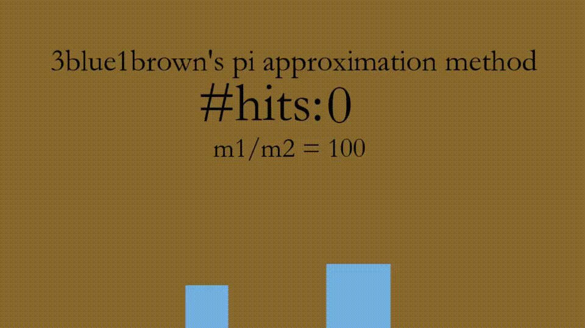
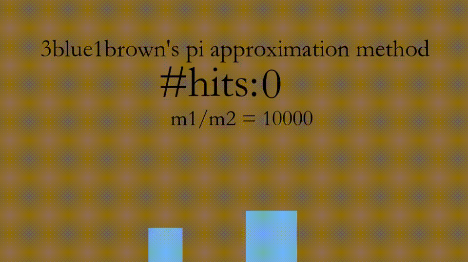

# 3b1b-Blocks
C++ program to simulate collisions between to blocks of different masses. When the mass of the right block is some power of 100 times the mass of the left block, the number of collisions is made up of digits of pi.

## Examples

